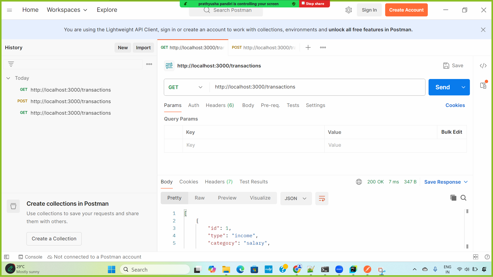
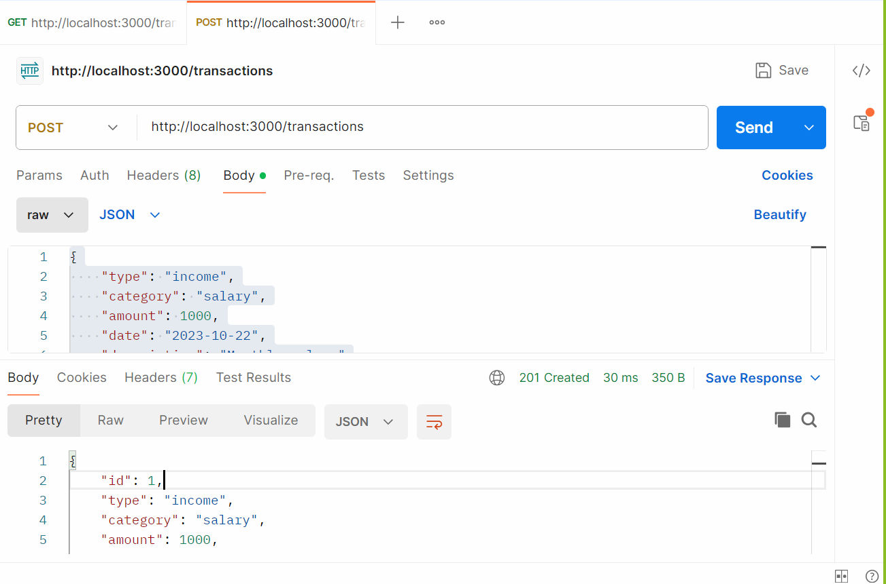
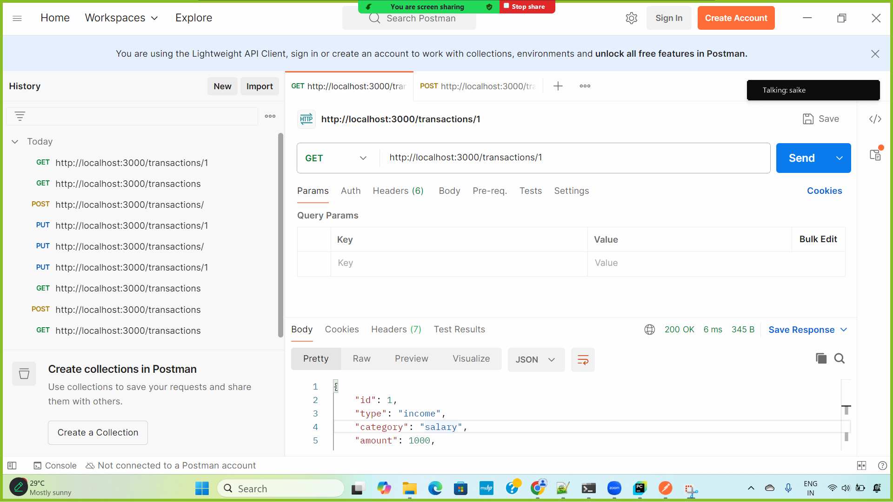
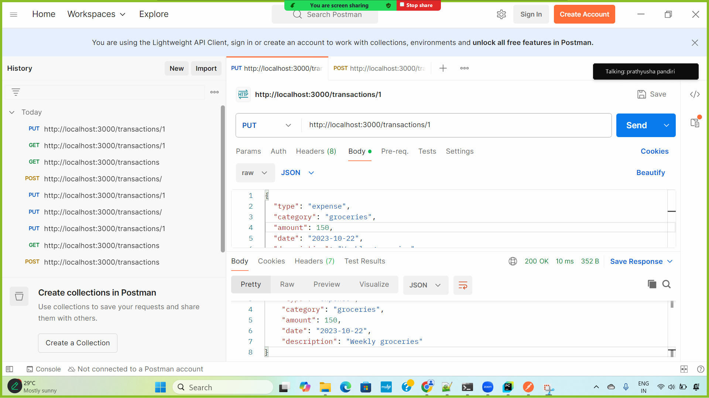
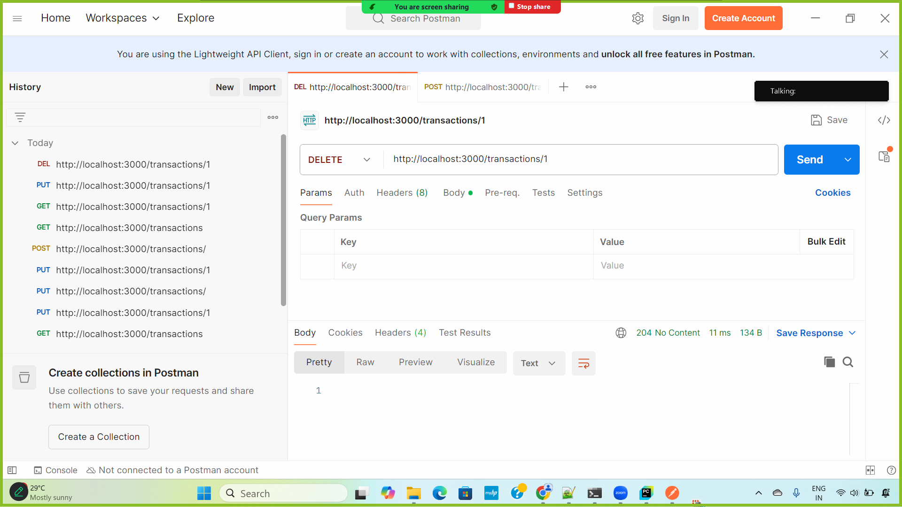
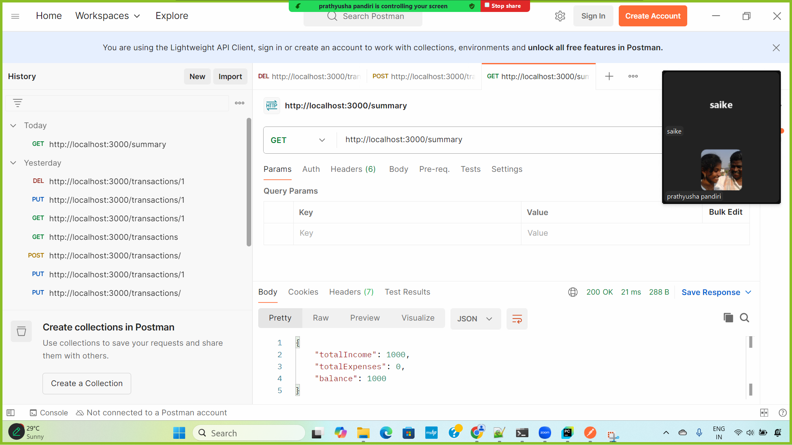

# Personal Expense Tracker API

## Setup and Run Instructions

1. Clone the repository:
   ```bash
   git clone <repository-url>
   cd personal-expense-tracker
   
2. Install Dependencies:
   ```bash
   npm install
3. Run the application:
   ```bash
   node src\app.js

# API Documentation
## POST /transactions
 - **Request Body**:
    ```bash
    {
      "type": "income",
      "category": "salary",
      "amount": 1000,
      "date": "2023-10-22",
      "description": "Monthly salary"
    }
- **Response**:
    * 201 Created: Returns the created transaction object.
## GET /transactions
- **Response**:

  - **200 OK**: Returns an array of transactions.
  
## GET /transactions/
- **Description**: Retrieves a transaction by its ID.

 - **Request Parameters**:

    * `id`: The ID of the transaction (integer).
- **Response**:

    - **200 OK**: Returns the transaction object.
    - **404 Not Found**: If the transaction does not exist.
- **Example Request**:
    ```bash
    GET /transactions/1
- **Example Response**:
    ```bash
    {
      "id": 1,
      "type": "income",
      "category": "salary",
      "amount": 1000,
      "date": "2023-10-22",
      "description": "Monthly salary"
    }

## PUT /transactions/
- **Description**: Updates a transaction by its ID.

 - **Request Parameters**:

    * `id`: The ID of the transaction (integer).
 - **Request Body**:
    ```bash
    {
       "type": "expense",
       "category": "groceries",
       "amount": 150,
       "date": "2023-10-22",
       "description": "Weekly groceries"
    }
- **Response**:

    - **200 OK**: Returns the updated transaction object.
    - **404 Not Found**: If the transaction does not exist.
- **Example Request**:
    ```bash
    PUT /transactions/1
- **Example Response**:
    ```bash
    {
      "id": 1,
      "type": "expense",
      "category": "groceries",
      "amount": 150,
      "date": "2023-10-22",
      "description": "Weekly groceries"
    }
  
## DLEETE /transactions/
- **Description**: Deletes a transaction by its ID.

 - **Request Parameters**:

    * `id`: The ID of the transaction (integer).

- **Response**:

    - **204 NO Content**: Indicates successful deletion.
    - **404 Not Found**: If the transaction does not exist.
- **Example Request**:
    ```bash
    DELETE /transactions/1
- **Example Response**:
    ```bash
    HTTP/1.1 204 No Content
  
### GET /summary
- **Description**: Retrieves a summary of transactions, including total income, total expenses, and balance.
- **Response**:
  - **200 OK**: Returns an object with the summary of transactions.

- **Example Request**:
  ```http
  GET /summary
- **Example Response**:
  ```http
    {
      "totalIncome": 5000,
      "totalExpenses": 3000,
      "balance": 2000
    }


# Postman Screenshots









]

